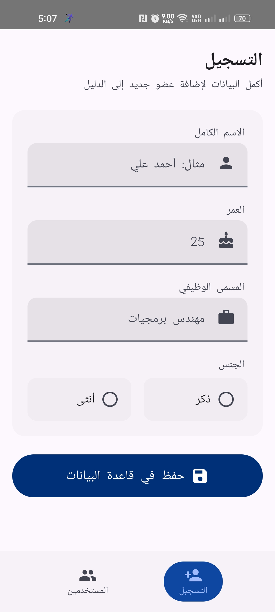
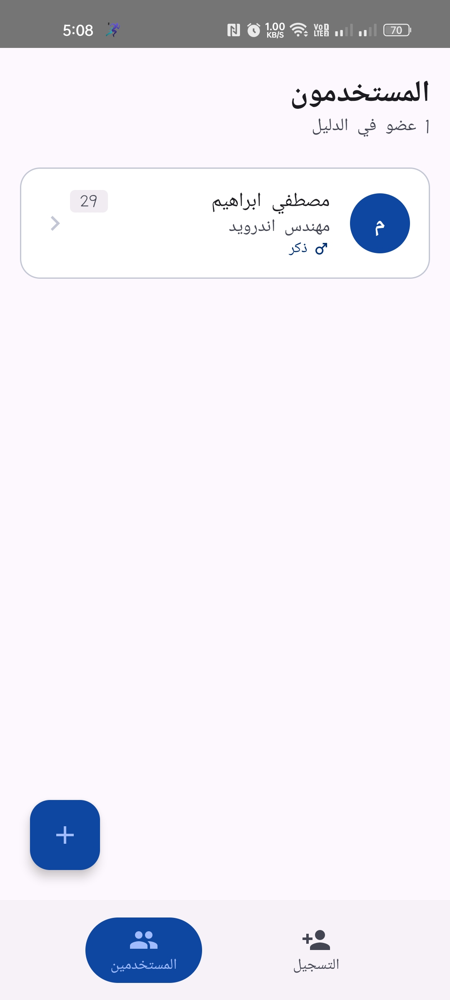

# User Management App 👥

<div align="center">


An Android application built with Clean Architecture, Jetpack Compose, and Room that allows users to register their information and view all saved records from a local database..

</div>

---

## 📱 Features

- **Input Screen** — Register a new user with name, age, job title, and gender
- **Display Screen** — View all saved users in a reactive list powered by Room + Flow
- **Field Validation** — Real-time inline error messages per field
- **RTL Support** — Full Arabic RTL layout direction
- **Loading States** — Spinner while data is being fetched from the database
- **Bottom Navigation** — Tab-based navigation between screens

---

## 🏗️ Architecture

This project follows **Clean Architecture** with a strict separation of concerns across three layers:

```
┌─────────────────────────────────────────────────┐
│                   UI Layer                       │
│  Composables · ViewModels · UiState · Actions   │
├─────────────────────────────────────────────────┤
│                 Domain Layer                     │
│   Use Cases · Entities · Validation · Repo IF   │
├─────────────────────────────────────────────────┤
│                  Data Layer                      │
│    Room DB · DAO · Entity · Mapper · RepoImpl   │
└─────────────────────────────────────────────────┘
```

The **Domain layer** has zero Android dependencies — it's pure Kotlin.

### UI Pattern: Unidirectional Data Flow (UDF)

```
User Interaction
      │
      ▼
  UserInputAction  ──►  ViewModel  ──►  Use Case
                             │
                       ┌─────┴──────┐
                       ▼            ▼
                   UiState       Events
                 (StateFlow)  (SharedFlow)
                       │            │
                       ▼            ▼
                  Composable    One-time effect
                  (re-render)   (navigation)
```

---

## 🧰 Tech Stack

| Category | Technology |
|----------|-----------|
| Language | Kotlin |
| UI | Jetpack Compose + Material 3 |
| Architecture | Clean Architecture + MVVM |
| DI | Hilt (Dagger) |
| Database | Room |
| Async | Kotlin Coroutines + Flow |
| Navigation | Jetpack Navigation Compose |
| Testing | JUnit4 · MockK · Truth · Turbine |
| Build | Gradle KTS + KSP |

---

## 📂 Project Structure

```
com.trendsoftware.usermanagementapp
│
├── domain/
│   ├── entity/         # User, Gender (pure Kotlin)
│   ├── repository/     # UserRepository interface
│   ├── usecase/        # AddUserUseCase, GetAllUsersUseCase, ValidateUserUseCase
│   ├── validation/     # UserValidator, ValidationResult, ValidationError
│   └── result/         # AddUserResult sealed interface
│
├── data/
│   ├── local/
│   │   ├── dao/        # UserDao
│   │   ├── database/   # UserDatabase (Room)
│   │   ├── entity/     # UserEntity
│   │   └── converter/  # GenderConverter (TypeConverter)
│   ├── mapper/         # User ↔ UserEntity extension functions
│   └── repository/     # UserRepositoryImpl
│
├── di/
│   ├── DatabaseModule  # Provides DB + DAO (Singleton)
│   └── RepositoryModule# Binds UserRepository → UserRepositoryImpl
│
└── ui/
    ├── components/     # Reusable composables (UserTextField, GenderOptionCard…)
    ├── input/          # InputScreen, InputViewModel, InputUiState, UserInputAction
    ├── display/        # DisplayScreen, DisplayViewModel, DisplayUiState
    ├── navigation/     # AppNavHost, Screen
    └── theme/          # Color, Typography, Theme (RTL)
```

---

## 🧪 Testing

Tests are written following the **TDD Red → Green** cycle visible in the commit history.

```
app/src/test/
├── domain/
│   ├── validation/     UserValidatorTest        (11 tests)
│   └── usecase/        ValidateUserUseCaseTest  (6 tests)
│                       AddUserUseCaseTest        (5 tests)
├── data/
│   ├── mapper/         UserMapperTest           (2 tests)
│   └── repository/     UserRepositoryImplTest   (2 tests)
```

### Run Unit Tests

```bash
./gradlew test
```

### Libraries Used in Tests

- **MockK** — Kotlin-idiomatic mocking
- **Truth** — Fluent assertions by Google
- **Turbine** — Flow testing
- **kotlinx-coroutines-test** — `runTest` for coroutine testing

---

## 🌿 Branch Strategy

```
main              ← stable releases
  └── develop     ← integration branch
        ├── feature/project-setup
        ├── feature/domain-layer
        ├── feature/data-layer
        ├── feature/di
        ├── feature/ui-layer
        ├── fix/validator-age-zero-test
        ├── fix/viewmodel-hardcoded-strings
        ├── fix/collect-state-lifecycle
        ├── fix/display-loading-state
        └── fix/remove-dead-code-event
```

Every fix was developed in an isolated branch and merged into `develop` via a clean merge commit.

---

## ⚙️ Getting Started

### Prerequisites

- Android Studio Meerkat or later
- JDK 11+
- Android SDK 24+

### Clone & Run

```bash
git clone https://github.com/mostafa-ibrahim38/user-management-app.git
cd user-management-app
```

Open in Android Studio → Run on emulator or physical device (API 24+).

---

## 🔑 Key Design Decisions

### ✅ `@Binds` over `@Provides` for Repository
Using `abstract @Binds` in `RepositoryModule` instead of `@Provides` avoids unnecessary class instantiation at compile time — Hilt can resolve the binding without generating extra code.

### ✅ `ValidationError` sealed class in UiState
Error fields in `InputUiState` hold `ValidationError?` (domain enum) instead of raw `String?`. String mapping is done in the UI layer via `stringResource`, keeping the ViewModel framework-free and fully unit-testable.

### ✅ Room Flow for reactive updates
`getAllUsers()` returns `Flow<List<User>>` from Room directly, so the Display screen updates automatically when any user is inserted — no manual refresh needed.

### ✅ Stateless Composables
`InputScreenContent` and `DisplayScreenContent` are stateless composables that accept `UiState` and a lambda. This makes them trivially previewable and testable without a ViewModel.

### ✅ `collectAsStateWithLifecycle()` everywhere
Both screens use `collectAsStateWithLifecycle()` to stop collecting from `StateFlow` when the app is backgrounded, preventing unnecessary resource consumption.

---

## 📸 Screens

| Input Screen | Display Screen |
|:---:|:---:|
|  |  |
| Register new user with validation | View all saved users with empty state |

---

## 👤 Author

**Mostafa Ibrahim**  
Android Developer  
[GitHub](https://github.com/mostafa-ibrahim38)

---

<div align="center">
  Built with ❤️ using Jetpack Compose & Clean Architecture
</div>
